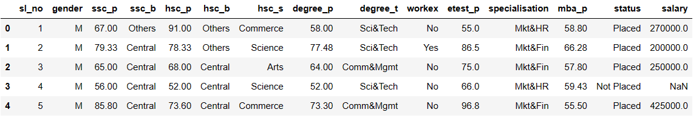

# Implementation-of-Logistic-Regression-Using-Gradient-Descent

## AIM:
To write a program to implement the the Logistic Regression Using Gradient Descent.

## Equipments Required:
1. Hardware – PCs
2. Anaconda – Python 3.7 Installation / Jupyter notebook

## Algorithm
1. Import the required packages and print the present data.

2. Print the placement data and salary data.

3. Find the null and duplicate values.

4. Using logistic regression find the predicted values of accuracy , confusion matrices.


## Program:
```
/*
Program to implement the the Logistic Regression Using Gradient Descent.
Developed by: Danica Christa
RegisterNumber: 212223240022
import pandas as pd
import numpy as np
import matplotlib.pyplot as plt
dataset = pd.read_csv("Placement_Data.csv")
dataset
dataset=dataset.drop('sl_no',axis=1)
dataset=dataset.drop('salary',axis=1)
dataset["gender"] = dataset["gender"].astype('category')
dataset["ssc_b"] = dataset["ssc_b"].astype('category')
dataset["hsc_b"] = dataset["hsc_b"].astype('category')
dataset["degree_t"] = dataset["degree_t"].astype('category')
dataset["workex"] = dataset["workex"].astype('category')
dataset["specialisation"] = dataset["specialisation"].astype('category')
dataset["status"] = dataset["status"].astype('category')
dataset["hsc_s"] = dataset["hsc_s"].astype('category')
dataset.dtypes
dataset["gender"] = dataset["gender"].cat.codes
dataset["ssc_b"] = dataset["ssc_b"].cat.codes
dataset["hsc_b"] = dataset["hsc_b"].cat.codes
dataset["degree_t"] = dataset["degree_t"].cat.codes
dataset["workex"] = dataset["workex"].cat.codes
dataset["specialisation"] = dataset["specialisation"].cat.codes
dataset["status"] = dataset["status"].cat.codes
dataset["hsc_s"] = dataset["hsc_s"].cat.codes
dataset
X=dataset.iloc[:, :-1].values
Y=dataset.iloc[:, -1].values
Y
theta = np.random.randn(X.shape[1])
y=Y
def sigmoid(z):
    return 1/(1+np.exp(-z))
def loss(theta,X,y):
    h = sigmoid(X.dot(theta))
    return -np.sum(y * np.log(h) + (1-y) * np.log(1-h))
def gradient_descent (theta, X, y, alpha, num_iterations):
    m = len(y)
    for i in range(num_iterations):
        h = sigmoid(X.dot(theta))
        gradient = X.T.dot(h-y) / m
        theta -= alpha * gradient
    return theta
theta =  gradient_descent(theta, X, y, alpha=0.01, num_iterations=1000)
def predict(theta, X): 
    h = sigmoid(X.dot(theta))
    y_pred = np.where(h >= 0.5, 1, 0)
    return y_pred
y_pred = predict(theta, X)
accuracy=np.mean(y_pred.flatten()==y)
print("Accuracy:",accuracy)
print(y_pred)
print(Y)
xnew = np.array([[0,87,0,95,0,2,78,2,0,0,1,0]])
y_prednew = predict(theta,xnew)
print(y_prednew)
xnew = np.array([[0,0,0,0,0,2,8,2,0,0,1,0]])
y_prednew = predict(theta,xnew)
print(y_prednew)
*/
```

## Output:

Dataset:


Dataset.dtypes:



Status data


Labeled_dataset:


Dependent variable Y:


Accuracy:


y_pred:


Y:


y_pred:


 


## Result:
Thus the program to implement the the Logistic Regression Using Gradient Descent is written and verified using python programming.

